# 类的继承

继承，是子类继承父类的特征和行为，使得子类对象具有父类的实例域和方法。 继承是面向对象编程中，不可或缺的一部分。

## 使用方法

与 ES5 通过修改原型链实现继承不同，类通过 `extends` 关键字实现继承，继承父类的所有属性和方法。

```js
class Parent {}

class Child extends Parent {
  constructor() {
    super();
  }
}
```

>[!warning]
>子类必须在构造函数中调用 `super` 方法，否则新建实例会报错。这是因为子类自身的 `this` 指向，必须先通过父类的构造函数完成塑造，得到与父类同样的实例属性和方法，然后再对其进行加工，加上子类自己的实例属性和方法。如果不调用 `super` 方法，子类就无法得到 `this` 指向。

如果子类没有定义构造函数，这个方法会被默认添加。也就是说，不管有没有显式定义，任何一个子类都有构造函数。

另一个需要注意的是，在子类的构造函数中，**只有调用 `super` 之后，才可以使用 `this` 关键字**，否则会报错。

这是因为子类实例的构建，基于父类实例，只有 `super` 方法才能调用父类实例。

```js
class Parent {
  constructor(x, y) {
    this.x = x;
    this.y = y;
  }
}

class Child extends Parent {
  constructor(x, y, age) {
    this.age = age;
    // ReferenceError 引用错误
    // 错误原因：在调用 super 前调用 this

    super(x, y);

    // 正确
    this.age = age;
  }
}
```

## 访问父类

通过 [Object.getPrototypeOf()](/blog/前端技术/JavaScript/内置对象/Object/getPrototypeOf.html) 方法可以用来从子类上获取父类。

```js
Object.getPrototypeOf(Child) === Parent;
```

因此，可以通过此方法判断，一个类是否继承了另一个类。

## super

`super` 关键字，既可当作函数使用，也可以当作对象使用。

当 `super` 作为函数调用时，代表父类的构造函数。

ES6 要求，子类的构造函数继承父类时必须执行一次 `super` 函数。而且，`super()` 函数仅能在构造函数中执行，否则会报错。

```js
class Parent {}

class Child extends Parent {
  constructor() {
    super();
  }
}
```

虽 `super` 代表了父类 `Parent` 的 **构造函数**，但是返回的是子类 `Child` 的实例，即 `super` 内部的 `this` 指的是 `Child`，因此 `super()` 在这里相当于：

```js
Parent.prototype.constructor.call(this);
```

当 `super` 作为对象时：

- 在普通方法中，指向父类的原型对象
- 在静态方法中，指向父类

### 普通方法

在普通方法中，`super` 指向父类的原型对象。

```js
class Parent {
  console() {
    return 'Hello world!';
  }
}

class Child extends Parent {
  constructor() {
    super();

    const result = super.console();

    console.log(result);
    // Hello world!
  }
}
```

上面代码中，子类 `Child` 当中的 `super.console()`，就是将 `super` 当作一个对象使用。这时，`super` 在普通方法之中，指向 `Parent.prototype`，所以 `super.console()` 就相当于 `Parent.prototype.console()`。

>[!warning]
>ES6 规定，在子类普通方法中通过 `super` 调用父类的方法时，方法内部的 `this` 指向当前的子类实例。

🌰 示例：

```js
class Parent {
  constructor() {
    this.x = 1;
  }
  print() {
    console.log(this.x);
  }
}

class Child extends Parent {
  constructor() {
    super();
    this.x = 2;
  }
  console() {
    super.print();
    // print 方法执行时 this 实际指向的是子类实例
  }
}

const child = new Child();

child.console();
// 2
```

### 静态方法

在子类的静态方法中通过 `super` 调用父类的静态方法时，方法内部的 `this` 指向的是 **当前的子类，而不是子类的实例**。

```js
class Parent {
  constructor() {
    this.x = 1;
  }
  static console() {
    console.log(this.x);
  }
}

class Child extends Parent {
  constructor() {
    super();
    this.x = 2;
  }
  static print() {
    super.console();
  }
}

Child.x = 3;

Child.print();
// 3
```

>[!warning]
>使用 `super` 的时候，必须显式指定是作为函数，还是作为对象调用，否则会报错。

```js
class Parent {}

class Child extends Parent {
  constructor() {
    super();
    console.log(super);
    // 报错
  }
}
```

在子类调用父类方法 `this` 指向总结：

- `super` 作为对象时
  - 在子类的 **普通方法**
    - `super` 指向 **父类的原型对象** `Parent.prototype`
    - 通过 `super` 调用父类的方法时，方法内部的 `this` 指向当前的 **子类实例**
  - 在子类的 **静态方法**
    - `super` 指向 **父类**，而不是父类的原型对象
    - 通过 `super` 调用父类的方法时，方法内部的 `this` 指向当前 **子类**，而不是子类的实例

## 类的原型对象

大多数浏览器的 ES5 实现之中，每一个对象都有 `__proto__` 属性，指向对应的构造函数的 `prototype` 属性。

`Class` 作为构造函数的语法糖，同时有 `prototype` 属性和 `__proto__` 属性，因此同时存在两条继承链。

1. 子类的 `__proto__` 属性，表示 构造函数的继承，总是指向 父类。
2. 子类的 `prototype` 属性的 `__proto__` 属性，表示 方法的继承，总是指向 父类的 `prototype` 属性。

```mermaid
---
title: 类的原型对象继承关系
---
flowchart TB
    Parent-->|prototype|Parent.prototype
    Child-->|__ __proto__ __ |Parent
    Child-->|prototype|Child.prototype
    Child.prototype-->|"__ __proto__ __"|Parent.prototype
    

```



```js
class Parent {}

class Child extends Parent {}

console.log(Child.__proto__ === Parent);
// true

console.log(Child.prototype.__proto__ === Parent.prototype);
// true
```

类的继承是按照下面的模式实现的：

```js
class Parent {}

class Child {}

// 1. Child 子类的实例对象继承 Parent 父类的实例对象
Object.setPropertyOf(Child.prototype, Parent.prototype);

// 2. Child 子类继承 Parent 父类的静态属性
Object.setPropertyOf(Child, Parent);

const child = new Child();
```

[Object.setPrototypeOf](/blog/前端技术/JavaScript/内置对象/Object/setPrototypeOf.html) 方法的底层实现

上述实现等价于：

```js
Object.setPropertyOf(Child.prototype, Parent.prototype);
// 等价于
Child.prototype.__proto__ = Parent.prototype;

Object.setPropertyOf(Child, Parent);
// 等价于
Child.__proto__ = Parent;
```

这两条继承链，可以这样理解：

- 作为一个对象，子类的隐式原型对象（`__proto__` 属性）是父类（`Parent`）
- 作为一个构造函数，子类的显式原型对象（`prototype` 属性）是父类的显式原型对象（`prototype` 属性）的实例

**子类继承内置对象**

```js
class Child extends Object {}

// 相当于
console.log(Child.__proto__ === Object);
// true
console.log(Child.prototype.__proto__ === Object.prototype);
// true
```

这种情况下，`Child` 其实就是构造函数 `Object` 的拷贝，`Child` 的实例（对象）就是 `Object` 的实例（对象）。

**不存在继承关系**

```js
class Parent {}

Parent.__proto__ === Function.prototype;
// true
Parent.prototype.__proto__ === Object.prototype;
// true
```

这种情况下，`Parent` 作为一个基类（即不存在任何继承），就是一个普通函数，所以直接继承 `Function.prototype`。

但是，`Parent` 实例化后返回一个空对象（即 `Object` 实例），所以 `Parent.prototype.__proto__` 指向构造函数（`Object`）的 `prototype` 属性。

## 内置对象的继承

内置对象（又称原生构造函数）是指内置的构造函数，通常用来生成数据结构。

过去，原生构造函数是无法继承的，比如，不能自己定义一个 `Array` 的子类。之所以这样，是因为子类无法获得原生构造函数的内部属性，通过 `Array.apply()` 或者分配给原型对象都不行。原生构造函数会忽略 `apply` 方法传入的 `this`，也就是说，原生构造函数 `this` 无法绑定，导致拿不到内部属性。

而在 ES6 中允许继承原生构造函数定义子类，因为 ES6 是先新建父类的实例对象 `this` ，然后再用子类的构造函数修饰 `this`，使得父类的所有行为都可以继承。下面是一个继承 `Array` 的例子。

```js
class SubArray extends Array {
  constructor(...args) {
    super(...args);
  }
}

var arr = new SubArray();
arr[0] = 12;
console.log(arr.length);
// 1

arr.length = 0;
console.log(arr[0]);
// undefined
```

上面的例子说明，`extends` 关键字不仅可以用来继承类，还可以用来继承原生的构造函数。因此可以在原生数据结构的基础上，定义自己的数据结构。

>[!warning]
>继承 `Object` 的子类，有一个行为差异。

```js
class SubObject extends Object {
  constructor() {
    super(...arguments);
  }
}
const obj = new SubObject({ attr: true });

obj.attr === true;
// false
```

上述代码中，`SubObject` 继承了 `Object` ，但是无法通过 `super` 方法向父类 `Object` 传参。这是因为 ES6 改变了 `Object` 构造函数的行为，一旦发现 `Object` 方法不是通过 `new Object()` 这种形式调用，ES6 规定 `Object` 构造函数会忽略参数。
